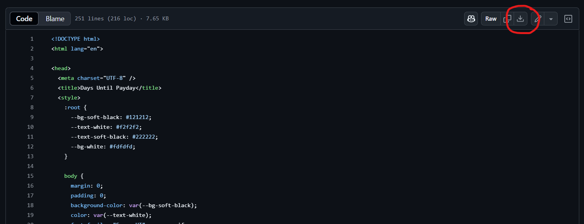

# 💸Payday Countdown Wallpaper

A motivational live wallpaper that counts down to your next payday — with an hourly short quotes to give you a lil bit of dopamine boost every now and then.

---

## ✨ Features

- 📅 Live countdown to payday (adjustable to your own payday)
- 💬 Hourly rotating motivational quotes
- 😎 Two version quotes:
  - `developers`
  - `non-developers`

---

## 🛠️ How to Use

### 🧱 Requirements

You need [Lively Wallpaper](https://www.rocksdanister.com/lively/)— a free, open-source live wallpaper engine for Windows. Install it before continuing to the next step.

---

### Setup Steps For Non-Developer

1. **Navigate to 'non-developers' folder above, open the HTML file and download it!**


2. **Edit your payday date**  
   ```js
   const PAYDAY = 28;
   ```
   Find this line (using Ctrl+F) and change the **28** to your payday date.

3. **Open Lively Wallpaper**  
   Click **"Add Wallpaper"** → **"Browse"** → **"Choose" payday-countdown-wallpaper.html**

4. **Enjoy the Motivation!**  
   Watch your screen update every hour with quotes, countdown to payday, and surprise confetti on payday.

---

### Setup Steps For Developer

1. **Clone or Download This Repo or Download the HTML File Manually**

   ```bash
   git clone https://github.com/your-username/motivator-wallpaper.git
   ```


2. **Edit your payday date**  
   ```js
   const PAYDAY = 28;
   ```
   Find this line (using Ctrl+F) and change the **28** to your payday date.

3. **Open Lively Wallpaper**  
   Click **"Add Wallpaper"** → **"Browse"** → navigate to:

   - `developers/payday-countdown-wallpaper.html`

4. **Enjoy the Motivation!**  
   Watch your screen update every hour with quotes, countdown to payday, and surprise confetti on payday.

---

## 🙌 Why This Exists

Because burnout is real, motivation is fragile, and payday is sacred.  
Also... your wallpaper shouldn’t be boring.

---

## 🧠 Author

Built by [@IdoMunthe](http://linkedin.com/in/idomunthe)  
Inspired by coffee, deadlines, and survival.
